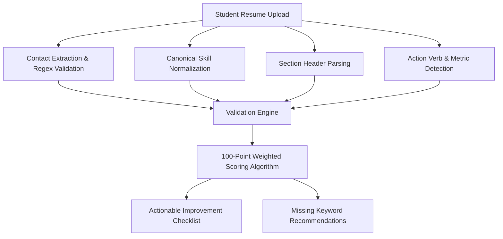
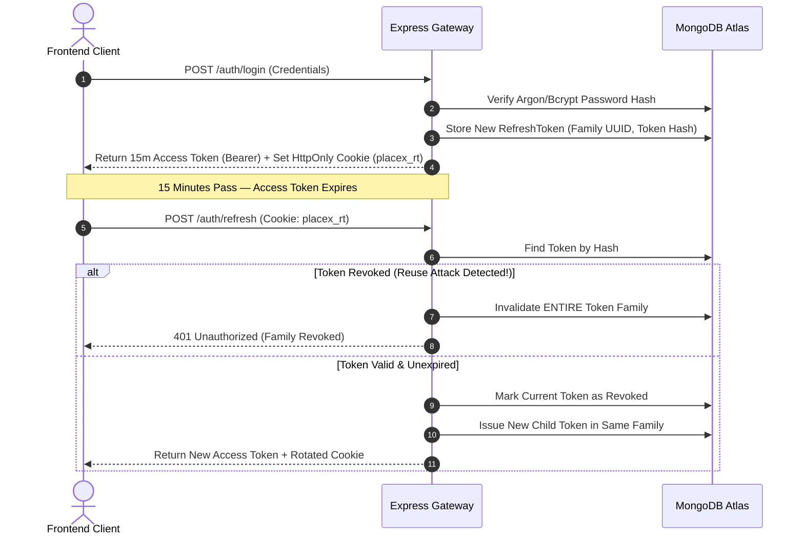
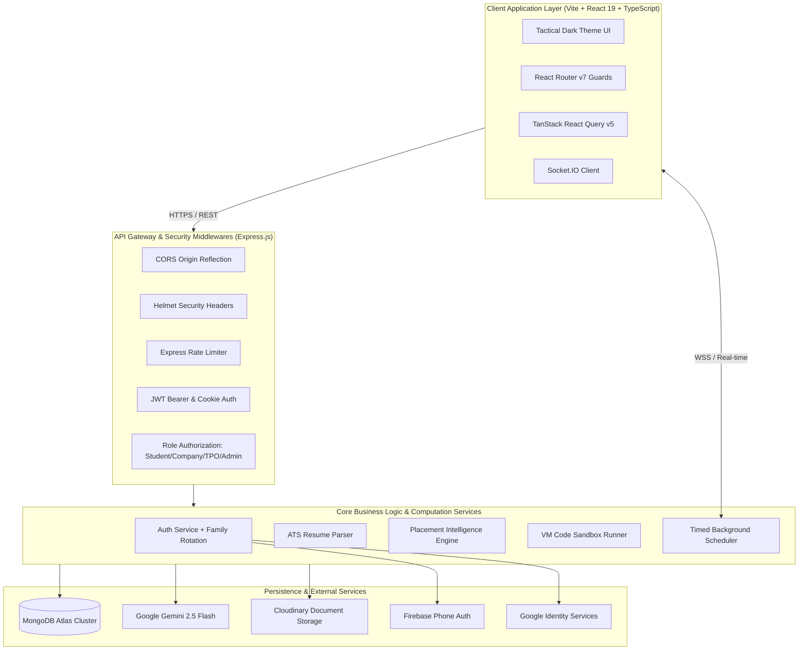
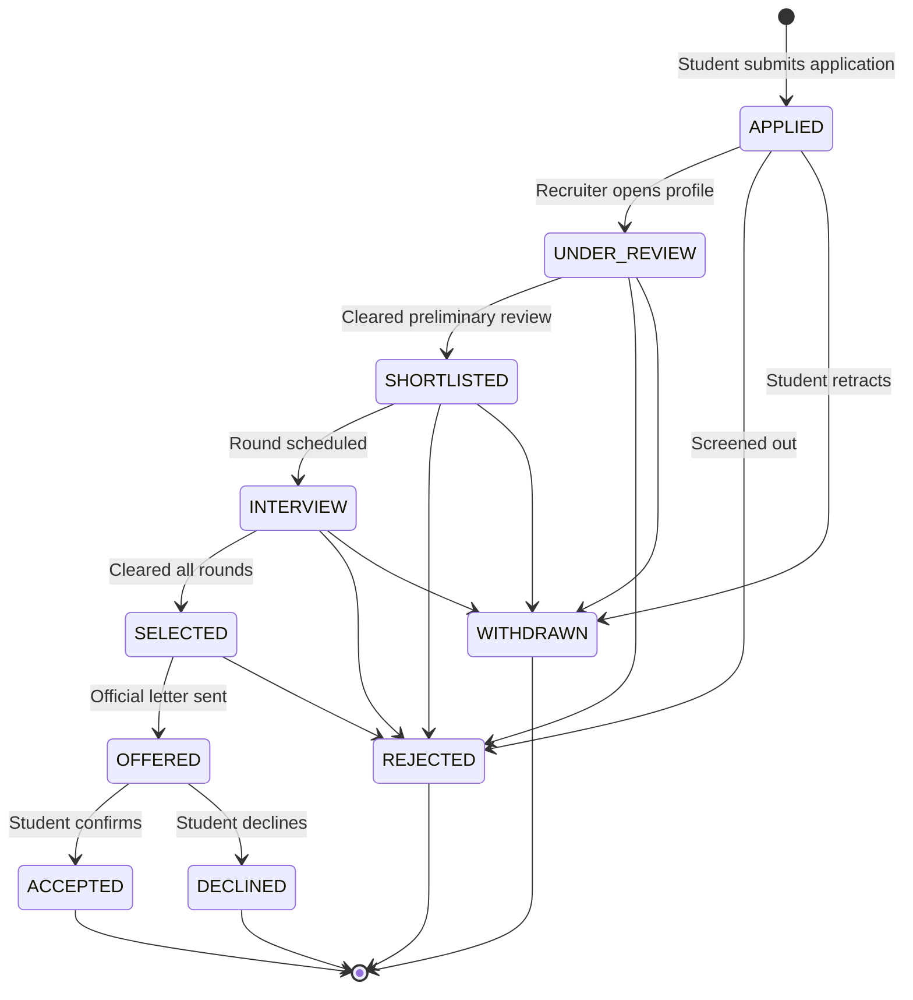

<div align="center">

# 🎓 PlaceX — Placement Operating System
### Enterprise-Grade Campus Recruitment Automation and Career Intelligence Platform

[-00C853?style=for-the-badge&logo=typescript&logoColor=white)](https://github.com/Nitinmall-1390/PlaceX)
[](https://placex-backend-3fmj.onrender.com/health)
[](https://placex-backend-3fmj.onrender.com/api-docs)
[](LICENSE)

<p align="center">
  <a href="https://placex-backend-3fmj.onrender.com/api/v1"><strong>Explore Live API »</strong></a> •
  <a href="https://placex-backend-3fmj.onrender.com/api-docs"><strong>Swagger Docs »</strong></a> •
  <a href="#-quickstart--local-setup"><strong>Run Locally »</strong></a> •
  <a href="#-system-architecture"><strong>Architecture »</strong></a>
</p>

</div>

---

## 📌 Table of Contents

- [Overview](#-overview)
- [The Problem & The Solution](#-the-problem--the-solution)
- [Multi-Stakeholder Feature Matrix](#-multi-stakeholder-feature-matrix)
- [Core Engineering Deep Dives](#-core-engineering-deep-dives)
  - [1. Placement Intelligence & PX Readiness Index](#1-placement-intelligence--px-readiness-index)
  - [2. Multi-Factor ATS Resume Analyzer](#2-multi-factor-ats-resume-analyzer)
  - [3. Isolated Coding Sandbox & Evaluation Engine](#3-isolated-coding-sandbox--evaluation-engine)
  - [4. Dual-Token Authentication & Family Rotation](#4-dual-token-authentication--family-rotation)
  - [5. Real-Time Socket.IO & Timed Scheduler](#5-real-time-socketio--timed-scheduler)
- [System Architecture](#-system-architecture)
- [Application State Machine](#-application-state-machine)
- [Tech Stack](#-tech-stack)
- [Repository Structure](#-repository-structure)
- [API Reference](#-api-reference)
- [Quickstart & Local Setup](#-quickstart--local-setup)
- [Environment Variables](#-environment-variables)
- [Pre-Configured Demo Credentials](#-pre-configured-demo-credentials)
- [Engineering Decisions & Trade-Offs](#-engineering-decisions--trade-offs)
- [Testing & Validation](#-testing--validation)
- [Roadmap](#-roadmap)
- [License](#-license)

---

## 💡 Overview

**PlaceX** is an end-to-end recruitment management and intelligence platform designed to replace disjointed spreadsheets, opaque shortlisting workflows, and manual communication during institutional campus drives.

Operating across four distinct role-based portals (**Student**, **Recruiter / Company**, **Training & Placement Officer [TPO]**, and **Platform Admin**), PlaceX manages the full student lifecycle: from ATS resume optimization and skill-gap diagnostics to live in-browser coding rounds, interview scheduling, and placement forecasting.

```
+-----------------------------------------------------------------------------+
|                                PlaceX CORE                                  |
|                                                                             |
|  [ STUDENTS ]        [ RECRUITERS ]          [ TPO OFFICERS ]      [ ADMIN ]|
|  - ATS Scoring       - Job Postings          - CGPA Filters        - Audits |
|  - Coding Sandbox    - Pipeline ATS Kanban   - Branch Analytics    - Approvals
|  - AI Interview Prep - Interview Scheduling  - Batch Forecasting   - Telemetry
+-----------------------------------------------------------------------------+
```

---

## 🎯 The Problem & The Solution

| Campus Placement Reality | The PlaceX Architectural Solution |
| :--- | :--- |
| **Manual Verification Delays**: TPOs spend days cross-checking student backlogs and CGPA cutoffs against company criteria in Excel. | **Automated Eligibility Engine**: Server-enforced institutional checks eliminate non-eligible candidates before application submission. |
| **Opaque Resume Screening**: Students receive automated rejections without actionable feedback on what their resumes lacked. | **Deterministic ATS Engine**: 100-point scoring algorithm with canonical skill normalization, impact metric detection, and missing keyword checklists. |
| **Fragmented Assessment Tooling**: Colleges rely on third-party assessment links that do not sync scores back into candidate profiles. | **Integrated Code Sandbox**: Node.js `vm`-isolated runtime environment providing timed execution, visible/hidden test assertions, and instant grading. |
| **Interview Scheduling Drops**: Missed rounds due to buried email notifications and timezone mismatches. | **Real-Time Notification Engine**: Socket.IO room delivery paired with automated 24h, 1h, and 15m idempotent background scheduler alerts. |

---

## 👥 Multi-Stakeholder Feature Matrix

### 🎓 1. Student Portal
* **Job Discovery & Matching**: Real-time compatibility index calculated from candidate profile vs. live job requirements.
* **100-Point ATS Analyzer**: Inspects contact data, quantifiable verbs, layout risks, and skill keyword density.
* **Technical Coding Sandbox**: Split-screen code editor with multi-language test case verification, console streaming, and strict server timers.
* **AI Career Assistant**: Google Gemini 2.5 Flash integration with structured prompt schemas for custom interview preparation.
* **Application Tracker**: Transparent stage progression (`APPLIED` ➔ `UNDER_REVIEW` ➔ `SHORTLISTED` ➔ `INTERVIEW` ➔ `OFFERED`).

### 🏢 2. Company / Recruiter Portal
* **Multi-Tier Job Builder**: Define package CTC, department criteria, active backlog allowances, and round structures.
* **Applicant Pipeline (ATS Kanban)**: Review applicant resumes, inspect AI fit scores, take recruiter notes, and transition statuses.
* **Coding Assessment Creator**: Compose custom programming questions with input/output test pairs and memory/execution constraints.
* **Interview Orchestrator**: Schedule technical/HR interviews with automatic candidate reminder generation.
* **Recruitment Funnel Analytics**: Measure conversion velocity, department-wise turnout, and offer acceptance ratios.

### 🏛️ 3. TPO (Training & Placement Officer) Portal
* **Eligibility & Policy Governance**: Lock criteria based on minimum CGPA thresholds and maximum allowed active backlogs.
* **Batch Verification Dashboard**: Verify student academic records and approve/freeze profiles for placement seasons.
* **Predictive Placement Forecasting**: Identify at-risk candidates and departments requiring curriculum interventions.
* **Assessment Auditing**: Inspect aggregate and individual code submission metrics across institutional tests.

### 🛡️ 4. Overseer Admin Portal
* **Company Verification**: Review and authenticate visiting enterprise accounts before jobs can be published.
* **System Health & Observability**: Real-time telemetry monitoring API latency, Socket.IO connections, and database health.
* **Security Audit Logging**: Immutable logs recording logins, role elevations, job updates, and profile modifications.
* **Global Maintenance Configuration**: Platform-wide settings toggleable with zero redeployment.

---

## 🔬 Core Engineering Deep Dives

### 1. Placement Intelligence & PX Readiness Index
The platform computes candidate employability via a deterministic, multi-dimensional heuristic formula (`backend/src/services/intelligence.service.js`). It avoids pseudo-random estimates in favor of real aggregated data:

$$\text{Readiness Index} = \sum_{i=1}^{n} (W_i \times S_i)$$

```
┌────────────────────────────────────────────────────────┐
│             PX READINESS WEIGHT BREAKDOWN              │
├──────────────────────────┬─────────────────────────────┤
│ Dimension                │ Weight                      │
├──────────────────────────┼─────────────────────────────┤
│ Primary Resume Upload    │ 20%                         │
│ ATS Resume Score         │ 15%                         │
│ Profile Skills Breadth   │ 15%                         │
│ Documented Projects      │ 15%                         │
│ Academic Record (CGPA)   │ 15%                         │
│ Assessment Performance   │ 10%                         │
│ Application Pipeline Act │ 05%                         │
│ Overall Profile Density  │ 05%                         │
└──────────────────────────┴─────────────────────────────┘
```

The engine normalizes technical terms via a canonical alias dictionary (`js` ➔ `JavaScript`, `k8s` ➔ `Kubernetes`, `py` ➔ `Python`) before calculating Jaccard-style set overlap against live market job demand.

---

### 2. Multi-Factor ATS Resume Analyzer
The in-house ATS algorithm (`backend/src/services/ats.service.js`) parses and scores resumes across six core dimensions:



* **Action Verb Density**: Differentiates impact verbs (*architected, engineered, optimized, scaled*) from passive phrases (*handled, assisted*).
* **Quantifiable Metrics**: Scans for numbers, percentages, milliseconds, and monetary impacts indicating measurable contributions.
* **Formatting Risk Flags**: Warns against multi-column tables, text box artifacts, and unreadable character encodings.

---

### 3. Isolated Coding Sandbox & Evaluation Engine
Candidate coding rounds run in an isolated execution sandbox utilizing Node.js's native `vm` context (`backend/src/services/assessment.service.js`):

```javascript
// Sandboxed Execution Pattern
const sandbox = {
  input: testCase.input,
  output: '',
  console: {
    log: (...args) => {
      sandbox.output += args.map(a => (typeof a === 'object' ? JSON.stringify(a) : String(a))).join(' ') + '\n';
    },
  },
};
const context = vm.createContext(sandbox);
const script = new vm.Script(`${sourceCode}\n;if(typeof solution === 'function'){ console.log(solution(input)); }`);
script.runInContext(context, { timeout: 1500 });
```

* **Execution Constraints**: 1500ms hard execution timeout per test case to terminate infinite loops.
* **Output Normalization**: Canonical string whitespace normalization protects against platform-dependent newline quirks (`\r\n` vs `\n`).
* **Server-Authoritative Clock**: Prevents client-side manipulation of assessment countdown timers.

---

### 4. Dual-Token Authentication & Family Rotation
Authentication (`backend/src/services/auth.service.js`) relies on an enterprise dual-token strategy with automatic revocation of compromised token trees:



---

### 5. Real-Time Socket.IO & Timed Scheduler
* **Stateful User Rooms**: Upon JWT verification during handshake, clients automatically join a private room (`user_<userId>`).
* **Cron Daemon with Grace Recovery**: Runs a 30-second sweep (`backend/src/services/scheduler.service.js`) over scheduled notifications. If the server was offline, a 2-hour grace period prevents flooding users with stale alerts.
* **Idempotency Guard**: Automated interview reminders (24h, 1h, 15m before start) use deterministic idempotency keys (`INTERVIEW_REMINDER_<TAG>_<ID>_<USER>`) backed by a sparse database index.

---

## 🏗️ System Architecture



---

## 🔄 Application State Machine

Student job applications are governed by a strict unidirectional finite state machine (`backend/src/utils/constants.js`):



---

## 🛠️ Tech Stack

### Frontend Ecosystem
| Technology | Version | Purpose |
| :--- | :--- | :--- |
| **React** | `^19.2.8` | Core UI library |
| **TypeScript** | `~6.0.2` | Compile-time strict type safety |
| **Vite** | `^8.2.0` | Ultra-fast build tool and dev server |
| **Tailwind CSS** | `^3.4.19` | Utility-first styling with tactical design variables |
| **React Router** | `^7.7.1` | Client-side routing with role-based auth guards |
| **TanStack Query** | `^5.101.4`| Asynchronous server state caching and synchronization |
| **React Hook Form** | `^7.84.0` | High-performance form state management |
| **Zod** | `^4.4.3` | Schema validation and type inference |
| **Socket.IO Client**| `^4.8.3` | WebSocket client for live notification streaming |
| **Lucide React** | `^1.28.0` | Modern iconography system |

### Backend Ecosystem
| Technology | Version | Purpose |
| :--- | :--- | :--- |
| **Node.js** | `>=18.0.0`| Server runtime (ES modules) |
| **Express.js** | `^4.18.2` | HTTP web application framework |
| **MongoDB / Mongoose** | `^8.24.2` | Document database with schema enforcement & SRV clustering |
| **JSONWebToken** | `^9.0.2` | Access and refresh token generation & verification |
| **Bcrypt.js** | `^2.4.3` | Salting and hashing of user credentials |
| **Google Auth Library**| `^11.0.2` | Direct Google OAuth 2.0 ID token verification |
| **Firebase Admin** | `^14.3.0` | Phone number OTP token verification |
| **Multer** | `^1.4.5` | Multipart form-data handling for resumes |
| **Winston** | `^3.19.0` | Structured multi-level application logging |
| **Helmet** | `^7.0.0` | HTTP security response headers |

---

## 📂 Repository Structure

```text
PlaceX/
├── backend/
│   ├── src/
│   │   ├── app.js                   # Express application setup & middleware chain
│   │   ├── server.js                # Server entry point, DB bootstrap & Socket init
│   │   ├── socket.js                # Socket.IO authentication and room management
│   │   ├── seed.js                  # Database seeder (35+ students, 10 companies)
│   │   ├── config/
│   │   │   ├── database.js          # Resilient MongoDB Atlas SRV connection
│   │   │   ├── env.js               # Environment schema parsing & validation
│   │   │   ├── logger.js            # Winston logger transport configuration
│   │   │   └── swagger.js           # OpenAPI 3.0 specification setup
│   │   ├── controllers/             # HTTP request handlers
│   │   ├── integrations/
│   │   │   ├── ai-provider.js       # Base abstraction class for AI vendors
│   │   │   └── gemini/              # Gemini 2.5 Flash implementation
│   │   ├── middlewares/             # Auth, RBAC, Rate-limit, Error, Upload
│   │   ├── models/                  # 17 Mongoose models (User, Student, Job, etc.)
│   │   ├── routes/                  # Modular route declarations
│   │   ├── services/                # Business logic & algorithms
│   │   │   ├── intelligence.service.js  # PX Readiness & Job match engine
│   │   │   ├── ats.service.js           # 100-point resume scoring pipeline
│   │   │   ├── assessment.service.js    # Node.js VM execution sandbox
│   │   │   └── scheduler.service.js     # Timed cron reminder engine
│   │   ├── utils/                   # ApiError, ApiResponse, asyncHandler, crypto
│   │   └── validators/              # Joi request validation schemas
│   ├── package.json
│   └── .env.example
├── frontend/
│   ├── src/
│   │   ├── app/
│   │   │   ├── providers/           # QueryProvider, AuthProvider, SocketProvider
│   │   │   └── router/index.tsx     # React Router v7 routes with AuthGuard/RoleGuard
│   │   ├── components/
│   │   │   ├── layout/              # Student, Company, TPO, Admin, Root layouts
│   │   │   └── ui/                  # Reusable components & ErrorBoundary
│   │   ├── pages/
│   │   │   ├── auth/                # Login, Register, Forgot/Reset Password
│   │   │   ├── student/             # 13 student pages (ATS, Coding, Readiness, etc.)
│   │   │   ├── company/             # 9 recruiter pages (Jobs, ATS Kanban, Drives)
│   │   │   ├── tpo/                 # TPO governance, students roster, forecasting
│   │   │   └── admin/               # System metrics, audit logs, verification
│   │   ├── services/                # Axios apiClient with interceptors, socket
│   │   ├── constants/               # Roles, status mappings, navigation routes
│   │   └── types/                   # TypeScript interface definitions
│   ├── tailwind.config.js
│   ├── vercel.json                  # SPA routing rules for Vercel
│   ├── vite.config.ts
│   └── package.json
├── render.yaml                      # Backend deployment blueprint for Render
└── package.json                     # Root orchestrator package
```

---

## 🔌 API Reference

<details>
<summary><strong>Click to view key REST API endpoints</strong></summary>

### Authentication (`/api/v1/auth`)
| Method | Endpoint | Description | Access |
| :--- | :--- | :--- | :--- |
| `POST` | `/auth/register` | Register new user (Student / Recruiter) | Public |
| `POST` | `/auth/login` | Login with email & password | Public |
| `POST` | `/auth/google` | Verify Google ID token & sign in | Public |
| `POST` | `/auth/phone` | Verify Firebase Phone OTP token | Public |
| `POST` | `/auth/refresh` | Rotate refresh token & issue access token | Cookie |
| `POST` | `/auth/logout` | Revoke active refresh token | Authenticated |
| `GET` | `/auth/me` | Fetch active user identity & profile | Authenticated |

### Career Intelligence & Matching (`/api/v1/intelligence`)
| Method | Endpoint | Description | Access |
| :--- | :--- | :--- | :--- |
| `GET` | `/intelligence/readiness` | Calculate 8-dimension PX Readiness Index | Student |
| `POST` | `/intelligence/job-match` | Compute compatibility score for a job | Authenticated |
| `GET` | `/intelligence/skill-gap` | Analyze candidate skills vs market demand | Student |
| `GET` | `/intelligence/learning-plan`| Generate personalized 7-day study plan | Student |
| `POST` | `/intelligence/candidate-ranking`| AI multi-factor applicant rank for job | Recruiter / TPO |
| `GET` | `/intelligence/tpo-forecast`| Placement outcome projections & at-risk list | TPO / Admin |

### ATS Resume Analyzer (`/api/v1/ats`)
| Method | Endpoint | Description | Access |
| :--- | :--- | :--- | :--- |
| `POST` | `/ats/analyze` | Run 100-point multi-factor ATS analysis | Student |
| `GET` | `/ats/analyses` | Get historical resume analysis runs | Student |
| `GET` | `/ats/history` | Get score timeline across uploaded versions | Student |
| `POST` | `/ats/compare` | Compare score deltas between two versions | Student |

### Coding Assessments (`/api/v1/assessments`)
| Method | Endpoint | Description | Access |
| :--- | :--- | :--- | :--- |
| `POST` | `/assessments` | Create assessment with test cases | Recruiter / TPO |
| `GET` | `/assessments` | List accessible assessments | Authenticated |
| `POST` | `/assessments/:id/start`| Initialize candidate assessment attempt | Student |
| `POST` | `/assessments/:id/run` | Execute code against visible test cases | Student |
| `POST` | `/assessments/:id/submit`| Submit and grade against hidden test cases | Student |
| `GET` | `/assessments/:id/result`| Fetch submission breakdown & score | Student |

### Applications & Jobs (`/api/v1/applications`, `/api/v1/jobs`)
| Method | Endpoint | Description | Access |
| :--- | :--- | :--- | :--- |
| `GET` | `/jobs` | List published jobs with query filters | Authenticated |
| `POST` | `/jobs` | Create job requisition | Recruiter |
| `POST` | `/applications` | Apply to job with chosen resume | Student |
| `PATCH`| `/applications/:id/status`| Transition status in hiring pipeline | Recruiter |

</details>

---

## 🚀 Quickstart & Local Setup

### Prerequisites
- **Node.js**: `v18.0.0` or higher
- **npm**: `v9.0.0` or higher
- **MongoDB**: Local MongoDB instance (`mongodb://localhost:27017`) or a free [MongoDB Atlas](https://www.mongodb.com/cloud/atlas) cluster URI.

### 1. Clone the Repository
```bash
git clone https://github.com/Nitinmall-1390/PlaceX.git
cd PlaceX
```

### 2. Configure Backend Environment
Create `backend/.env`:
```bash
cd backend
cp .env.example .env
```

Ensure the following variables are configured in `backend/.env`:
```env
PORT=5000
NODE_ENV=development
MONGODB_URI=mongodb://localhost:27017/placex
JWT_ACCESS_SECRET=your-super-secret-access-key-minimum-32-chars-long
JWT_REFRESH_SECRET=your-super-secret-refresh-key-minimum-32-chars-long
JWT_ACCESS_EXPIRES_IN=15m
JWT_REFRESH_EXPIRES_IN=7d
CLIENT_URL=http://localhost:5173
```

### 3. Populate Demo Database
Run the seed script to create all collections, indices, 35+ realistic student profiles, companies, jobs, applications, and assessments:
```bash
# Inside backend directory
node src/seed.js
```

### 4. Start the Backend Server
```bash
npm run dev
# Backend running at http://localhost:5000
# Swagger docs live at http://localhost:5000/api-docs
```

### 5. Configure & Launch Frontend
In a new terminal window:
```bash
cd ../frontend
npm install
npm run dev
# Frontend live at http://localhost:5173
```

---

## 🔑 Pre-Configured Demo Credentials

Seeded directly by `node src/seed.js` for instant testing:

| Portal Role | Email Address | Password | Primary Capabilities |
| :--- | :--- | :--- | :--- |
| **Student** | `student@placex.com` | `Password123!` | ATS Analyzer, Coding Sandbox, Job Apply |
| **Company** | `company@placex.com` | `Password123!` | Job Wizard, Kanban Pipeline, Interviewer |
| **TPO Officer** | `tpo@placex.com` | `Password123!` | Eligibility Rules, Roster, Batch Analytics |
| **Overseer Admin** | `admin@placex.com` | `Password123!` | Company Verification, Audit Logs, Settings |

---

## 🔒 Environment Variables

| Variable | Scope | Description | Required |
| :--- | :--- | :--- | :--- |
| `PORT` | Backend | HTTP Port for Express server (Default: `5000`) | No |
| `NODE_ENV` | Backend | Environment flag (`development` \| `production`) | Yes |
| `MONGODB_URI` | Backend | Connection string for MongoDB database | Yes |
| `JWT_ACCESS_SECRET` | Backend | Secret key used to sign access JWTs | Yes |
| `JWT_REFRESH_SECRET`| Backend | Distinct secret key used for refresh tokens | Yes |
| `CLIENT_URL` | Backend | Client origin URL for CORS policy | Yes |
| `GEMINI_API_KEY` | Backend | Google AI API key for Gemini career guidance | Optional |
| `GOOGLE_CLIENT_ID` | Backend / Frontend | Google OAuth 2.0 Web Client ID | Optional |
| `CLOUDINARY_CLOUD_NAME` | Backend | Cloudinary cloud identifier for resume PDFs | Optional |
| `VITE_API_BASE_URL` | Frontend | Base URL to the PlaceX backend API | Yes |
| `VITE_SOCKET_URL` | Frontend | Socket.IO connection URL | Yes |

---

## 🧠 Engineering Decisions & Trade-Offs

### 1. In-Memory Node VM Sandbox vs. Containerized Docker Runner
* **Problem**: Evaluating candidate code submissions securely without introducing 5–10 second cold-start latencies.
* **Decision**: Implemented isolated execution via Node.js native `vm.createContext()` with 1500ms hard timeouts and stripped context primitives.
* **Reason**: Containerizing every test submission via Docker requires heavy daemon infrastructure and increases operational costs for university self-hosting.
* **Result**: Sub-second execution speeds (<50ms per test case) with memory-leak protection.

### 2. Token Family Rotation vs. Stateless JWT Refresh
* **Problem**: Traditional refresh tokens are long-lived and susceptible to exfiltration.
* **Decision**: Implemented refresh token families with database tracking (`models/RefreshToken.js`). Each refresh invalidates the current token and issues a child token.
* **Reason**: If a malicious actor presents a previously used refresh token, the server immediately revokes the **entire family**, preventing session hijacking.
* **Result**: Banking-grade session protection with minimal database footprint.

### 3. Grace-Period Daemon vs. Standard In-Memory Interval
* **Problem**: Deploying on free/serverless tiers (such as Render) causes background intervals to sleep, causing missed interview reminders.
* **Decision**: Implemented a 30s cron with a 2-hour grace period and persistent MongoDB timestamp queries (`scheduledFor <= now && processed == false`).
* **Reason**: Guarantees that when the server awakens from sleep, any notifications that were scheduled during downtime are dispatched immediately.
* **Result**: High delivery reliability without requiring external message brokers (RabbitMQ/Kafka).

---

## 🧪 Testing & Validation

The codebase includes end-to-end integration and security test suites:

```bash
# Run Auth & Notification E2E test suite (15/15 passing checks)
node backend/test-auth-notifications-e2e.js

# Run Intelligence & Readiness Index test suite
node backend/test-intelligence-e2e.js

# Run Google OAuth & Phone OTP E2E verification
node backend/test-oauth-phone-e2e.js

# Validate Frontend strict TypeScript types
cd frontend && npm run typecheck
```

---

## 🗺️ Roadmap

- [x] Dual-Token Family Rotation with reuse detection
- [x] Deterministic 100-Point ATS Resume Analysis Engine
- [x] In-Browser Coding Sandbox with test case evaluation
- [x] Real-time Socket.IO notification streaming
- [x] Google Gemini 2.5 Flash Career Assistant integration
- [ ] Multi-language code execution via WebAssembly sandbox (Python/C++)
- [ ] Biometric Proctoring & Tab-Switch detection during assessments
- [ ] Calendar sync integration (Google Calendar & Outlook ICS export)
- [ ] Automated bulk resume parsing using OCR for scanned documents

---

## 📄 License

Distributed under the **MIT License**. See `LICENSE` for more information.

---

<div align="center">
  <sub>Built with precision by <strong>Nitin Mall</strong> • Powered by Node.js, React 19 & MongoDB Atlas</sub>
</div>
